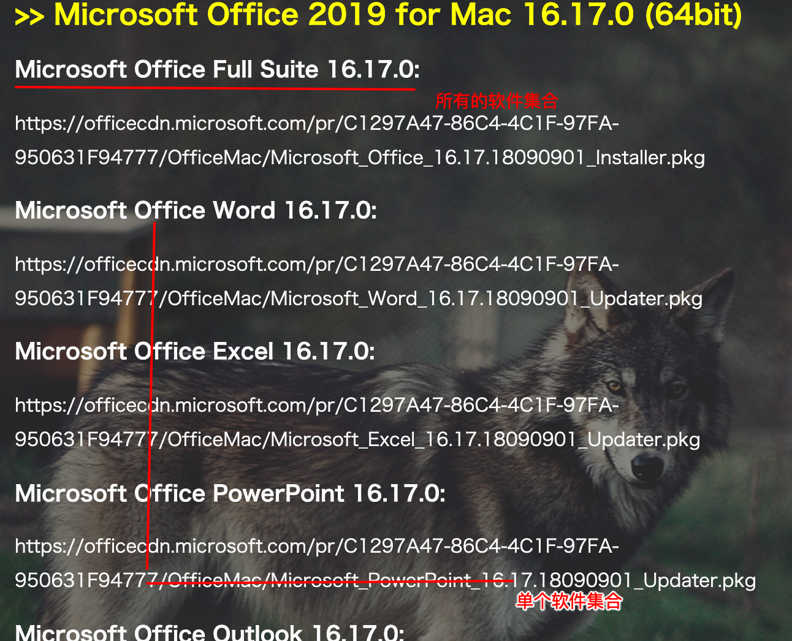
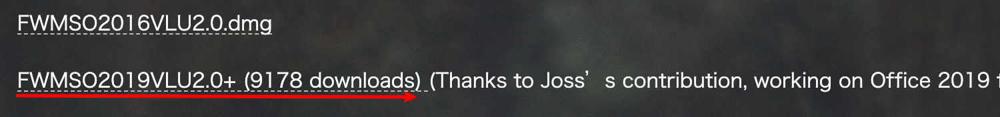

链接地址：https://www.firewolf.science/2015/09/microsoft-office-2016-for-mac-15-25-0-with-vl-license-utility/

备注：

版本： Office 2019

激活软件： FWMS2016VLU2.0+

步骤；

1. 下载二者链接文件
2. 在未登录情况下运行激活软件

问题：

 1. 激活软件下载后软件包损坏

    http://baijiahao.baidu.com/s?id=1658419724787684889&wfr=spider&for=pc

	2. 安装后软件无法打开（前Office软件未清理干净）

    https://support.office.com/en-us/article/uninstall-office-for-mac-eefa1199-5b58-43af-8a3d-b73dc1a8cae3